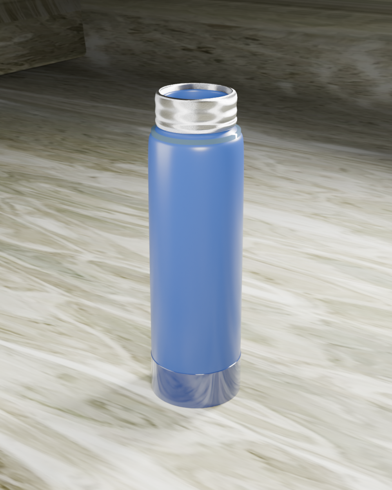

<div align="center">

<h1>JustThreed</h1>

<p><i>Product mockups from plain English. Describe your product, get a photorealistic render in Blender — no 3D skills needed.</i></p>

<p>
  <a href="https://github.com/Phanikondru/justthreed/blob/main/LICENSE"></a>
  
  <a href="https://pypi.org/project/justthreed/"></a>
  <a href="https://github.com/sponsors/Phanikondru"></a>
  <a href="https://github.com/Phanikondru/justthreed/stargazers"></a>
</p>

<table>
  <tr>
    <td></td>
    <td></td>
  </tr>
</table>

</div>

---

JustThreed connects Blender to any AI client (Claude, Gemini, ChatGPT, Cursor, or local models via Ollama) through the [Model Context Protocol](https://modelcontextprotocol.io/). You describe your product in plain English and the AI builds the shape, materials, lighting, camera, and final render for you.

## Core features

- Generate product mockups from natural-language prompts — jars, bottles, packaging, skincare, candles.
- Full Blender control via MCP: create meshes, apply PBR materials, set up studio lighting, position cameras, render.
- Works with Claude Desktop, Claude Code, Cursor, VSCode, Gemini CLI, Ollama, and OpenRouter.
- Two-way scene awareness — the AI reads the current scene before changing it, so nothing gets duplicated or overwritten.
- Save and resume scenes across chats with `.blend` files.
- Poly Haven asset library integration for textures and HDRIs.
- Run arbitrary Blender Python when the built-in tools aren't enough.
- 100% free and open source (MIT).

## Installation

### 1. Install `uv`

**macOS / Linux:**
```bash
curl -LsSf https://astral.sh/uv/install.sh | sh
```

**Windows:**
```powershell
powershell -ExecutionPolicy ByPass -c "irm https://astral.sh/uv/install.ps1 | iex"
```

### 2. Install the Blender addon

1. Download `addon.py` from this repo.
2. In Blender: **Edit → Preferences → Add-ons → Install from Disk** and select `addon.py`.
3. Enable **Interface: JustThreed**.

### 3. Start the MCP server inside Blender

Press **N** in the 3D viewport → click the **JustThreed** tab → click **Start MCP Server**.

> ⚠️ You need to do this **every time you open Blender**. The addon opens a socket on `localhost:9876` that your AI client talks to — if it's not running, tool calls will fail with "connection refused".

To verify it's live:
```bash
lsof -nP -iTCP:9876   # macOS / Linux
netstat -ano | findstr :9876   # Windows
```

### 4. Connect your AI client

Add this to your client's MCP config:

```json
{
  "mcpServers": {
    "justthreed": {
      "command": "uvx",
      "args": ["justthreed"]
    }
  }
}
```

- **Claude Desktop**: Settings → Developer → Edit Config
- **Claude Code**: `claude mcp add --scope user justthreed -- uvx justthreed`
- **Cursor / VSCode**: your MCP settings file (and raise *Max tool calls per request* to 50–100)
- **Gemini CLI**: `~/.gemini/settings.json` — and run `/yolo` inside the CLI to enable tool chaining
- **Ollama / OpenRouter**: select the provider in the JustThreed sidebar panel

Restart the client after editing config — MCP servers are only loaded at startup.

## Example prompts

```
Create a cream jar with a glossy pink body and a dark glass lid
Set up a marble surface with soft studio lighting
Add three jars scattered around the hero jar at different angles
Render at 1920x1080 with depth of field focused on the hero
```

## Tips for complex scenes

Every AI client has a per-turn tool-call limit. A full render can need 15–40 tool calls. If the AI pauses mid-build:

- **Just keep going**: reply with *"continue — call `get_scene_info` first"*.
- **Stage your prompts**: shape → materials → lighting → render. End each stage with `render_and_show`.
- **Save and resume**: `save_blend_file` in one chat, `open_blend_file` in the next.

Claude Code CLI and Gemini CLI (`/yolo` mode) chain the most tools per turn. Claude Desktop pauses sooner. Ollama works best with one stage per prompt.

## Limitations

- Not yet on the Blender Extensions platform — install `addon.py` manually for now.
- The MCP server must be started manually each Blender session (auto-start is on the roadmap).
- `execute_code` runs arbitrary Python — save before using.
- Local Ollama models need more hand-holding than Claude or Gemini for complex scenes.
- Artistic judgment (composition, style) still needs a human in the loop.

## Requirements

- Blender 4.5.0+
- Python 3.11+ (bundled with Blender 4.5+)
- `uv` package manager
- An MCP-compatible AI client

## Contributing

Contributions are welcome — new tools, asset library integrations, docs, bug fixes. Open an issue or PR. Roadmap ideas:

- One-click install via the Blender Extensions platform
- Auto-start the MCP server on Blender launch
- Built-in model selector UI
- Animation, rigging, and Sketchfab support
- FBX / GLTF export pipeline for Unity and Unreal

I'm figuring this out as I go — if something's broken or unclear, please raise an issue 🙏

## Support

- 💖 [Sponsor on GitHub](https://github.com/sponsors/Phanikondru)
- ⭐ Star this repo so others can find it
- 📣 Share your renders and tag [@Phanikondru](https://x.com/Phanikondru)

## License

MIT — free to use, modify, and distribute. See [LICENSE](LICENSE).

## Acknowledgements

- [Blender Foundation](https://www.blender.org/)
- [Anthropic](https://www.anthropic.com/) for MCP
- [ahujasid/blender-mcp](https://github.com/ahujasid/blender-mcp) — original inspiration
- [Poly Haven](https://polyhaven.com/) and [Ollama](https://ollama.com/)

---

Connect: [LinkedIn](https://www.linkedin.com/in/phanindhra-kondru-436220205/) · [X](https://x.com/Phanikondru)
